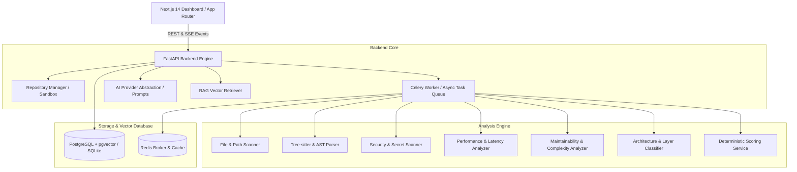
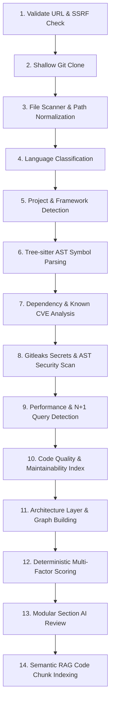

# 🔍 CodeXray

<div align="center">


<p align="center">
  <strong>Production-grade Code Intelligence Platform for Architecture, Security, Performance & Code Quality Analysis with Semantic RAG Chat.</strong>
</p>

[Key Capabilities](#-key-capabilities) •
[Architecture](#-system-architecture) •
[Analysis Pipeline](#-14-stage-analysis-pipeline) •
[Quickstart](#-quickstart) •
[API Specs](#-api-endpoints) •
[Security Hardening](#-security--sandboxing)

</div>

---

## 🌟 Executive Overview

**CodeXray** is an advanced developer tool and code intelligence engine. It ingests any public or private Git repository, clones it into an isolated sandbox, parses code structures with **Tree-sitter AST**, scans for secrets & CVEs, traces performance bottlenecks, maps multi-tier architectural layers, and indexes code into a vector store for natural language semantic Q&A with line-level code citations.

---

## 🏗️ System Architecture



---

## ⚡ 14-Stage Analysis Pipeline



---

## ✨ Key Capabilities

### 1. 🏛️ Architecture & Modularity Mapping
- Classifies codebase files into logical architectural tiers: **Frontend, API, Service, Repository, Database, Infrastructure, Core**.
- Constructs a directed module import graph.
- Calculates **Afferent ($C_a$)** & **Efferent ($C_e$)** Coupling and Instability indices.
- Discovers **Circular Dependencies** ($A \to B \to A$) using cycle-detection algorithms.

### 2. 🛡️ Deep Security & Secret Scanner
- **Gitleaks-Grade Secret Engine**: Scans for AWS keys, GitHub PATs, JWT tokens, OpenAI keys, Slack webhooks, and private keys with **Shannon Entropy analysis** to prevent false alarms.
- **AST Vulnerability Rules**: Detects SQL Injection, Command Injection (`shell=True`), Insecure Deserialization (`pickle`/unsafe `yaml`), SSRF vulnerabilities, and Disabled SSL certificates (`verify=False`).
- **Interactive Remediation**: "Explain with AI" breaks down threat vectors and suggests refactored code snippets.

### 3. ⚡ Performance & Efficiency Diagnostics
- **N+1 Query Detection**: Flags database queries executed inside iterative `for`/`while` loops.
- **Async Event-Loop Blocking**: Identifies blocking synchronous I/O (`time.sleep`, synchronous `requests`) inside async coroutines.
- **Algorithm Complexity**: Identifies deeply nested loops ($O(N^3)+$) and catastrophic regular expression backtracking risks (ReDoS).

### 4. 📊 Code Quality, Maintainability & Technical Debt
- **Maintainability Index (MI)**: Computed via standard SEI / Radon formulas.
- **Cyclomatic Complexity (CC)**: Average complexity per routine, max complexity hotspots, and oversized function warnings.
- **Code Duplication**: Line-block token hashing across files.

### 5. 📦 Multi-Ecosystem Dependency & CVE Checker
- Parses `package.json`, `requirements.txt`, `pyproject.toml`, `go.mod`, `pom.xml`, `Cargo.toml`.
- Flags unpinned dependencies and maps known security advisories.

### 6. 🤖 "Ask Your Codebase" Semantic RAG Chat
- AST-aware symbol chunking preserving function/class boundaries.
- Fast vector similarity search with line-level code citations and snippet previews.
- Prompt injection defense boundaries (`<UNTRUSTED_CODE>` delimiters).

---

## 🚀 Quickstart

### Option 1: Docker Compose (Full Production Stack)

```bash
# Clone the repository
git clone https://github.com/your-username/codexray.git
cd codexray

# Copy environment configuration
cp .env.example .env

# Build and start all services (Backend, Frontend, PostgreSQL+pgvector, Redis, Celery Worker)
docker compose up --build
```

- **Frontend Dashboard:** [http://localhost:3000](http://localhost:3000)
- **FastAPI OpenAPI Swagger:** [http://localhost:8000/docs](http://localhost:8000/docs)

---

### Option 2: Standalone Local Development

#### 1. Backend Setup

```bash
cd backend

# Create and activate virtual environment
python -m venv .venv
source .venv/bin/activate  # On Windows: .venv\Scripts\activate

# Install requirements
pip install -r requirements.txt

# Run FastAPI backend
uvicorn app.main:app --reload --port 8000
```

#### 2. Frontend Setup

```bash
cd frontend

# Install Node dependencies
npm install

# Run Next.js in development mode
npm run dev
```

Visit [http://localhost:3000](http://localhost:3000) in your browser.

---

## 📡 API Endpoints

| Method | Endpoint | Description |
| :--- | :--- | :--- |
| `POST` | `/api/v1/repositories/analyze` | Initiates asynchronous 14-stage codebase analysis |
| `GET` | `/api/v1/repositories` | Lists analyzed repositories |
| `GET` | `/api/v1/analyses/{id}` | Retrieves full analysis results, scores, and summaries |
| `GET` | `/api/v1/analyses/{id}/status` | Real-time stage and progress polling endpoint |
| `GET` | `/api/v1/analyses/{id}/events` | Server-Sent Events (SSE) progress stream |
| `GET` | `/api/v1/analyses/{id}/issues` | Lists filtered issues (CRITICAL, HIGH, MEDIUM, LOW) |
| `POST` | `/api/v1/analyses/{id}/issues/{issue_id}/explain` | AI explanation and suggested code refactor diff |
| `GET` | `/api/v1/analyses/{id}/architecture` | Module nodes, layers, and dependency edges graph |
| `GET` | `/api/v1/analyses/{id}/dependencies` | Tracked dependencies and known CVE alerts |
| `POST` | `/api/v1/analyses/{id}/chat` | RAG 'Ask Your Codebase' question answering |
| `GET` | `/api/v1/analyses/{id}/report` | Exports full report (JSON or Markdown format) |

---

## 🔒 Security & Sandboxing

1. **SSRF Defense**: Strict URL validation blocking loopback (`127.0.0.1`, `localhost`), link-local, internal cloud metadata IP (`169.254.169.254`), and non-standard protocols (`file://`).
2. **Path Traversal Protection**: All filesystem accesses resolve relative to isolated cache boundaries.
3. **Resource Limits**: Strict limits on max repo size (150MB), max file size (1.5MB), max analyzed files (3000), and execution timeouts (300s).
4. **Prompt Injection Boundary Sanitization**: Untrusted repository source code and comments are enclosed in explicit safety delimiters so LLMs never treat code comments as instructions.

---

## 🧪 Running Tests

```bash
cd backend
pytest tests/ -v
```

All 18 test suites test security filters, AST multi-language parsers, analyzers, deterministic scoring formulas, RAG vector retrieval, and REST API flows.

---

## 📄 License

Distributed under the MIT License. See `LICENSE` for details.
